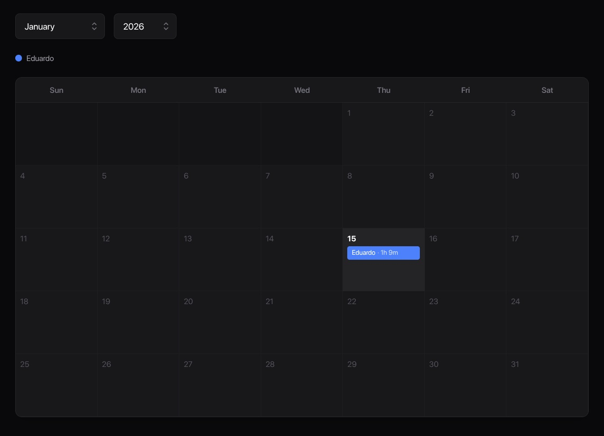
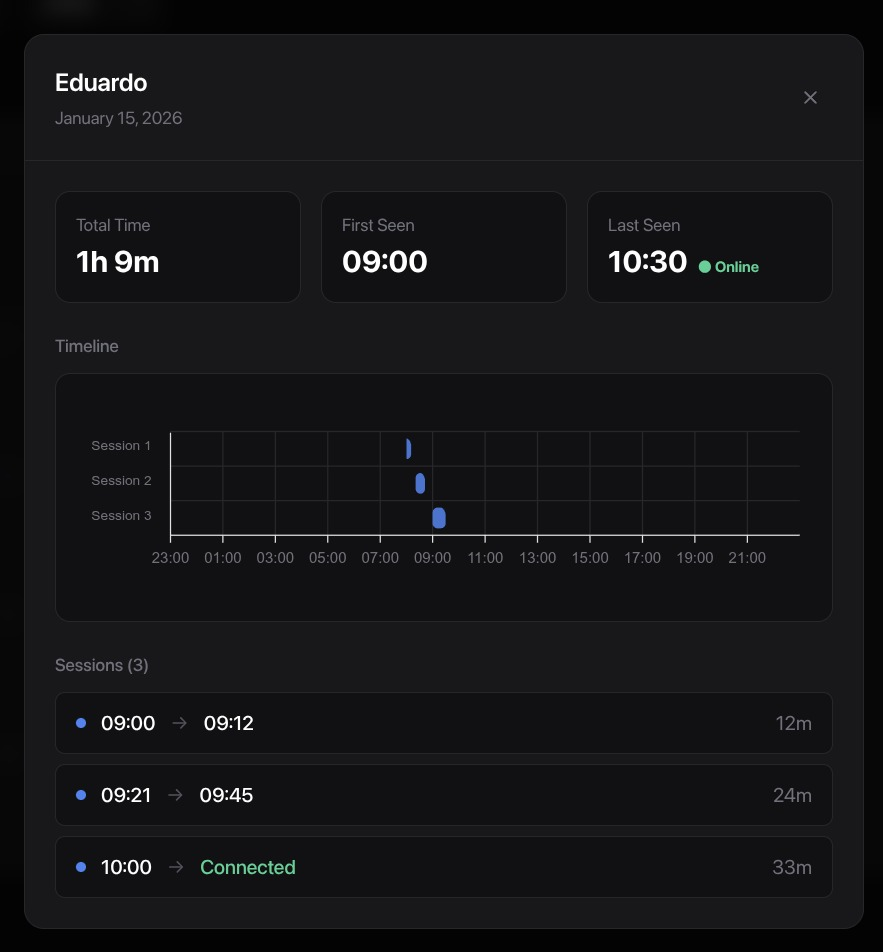
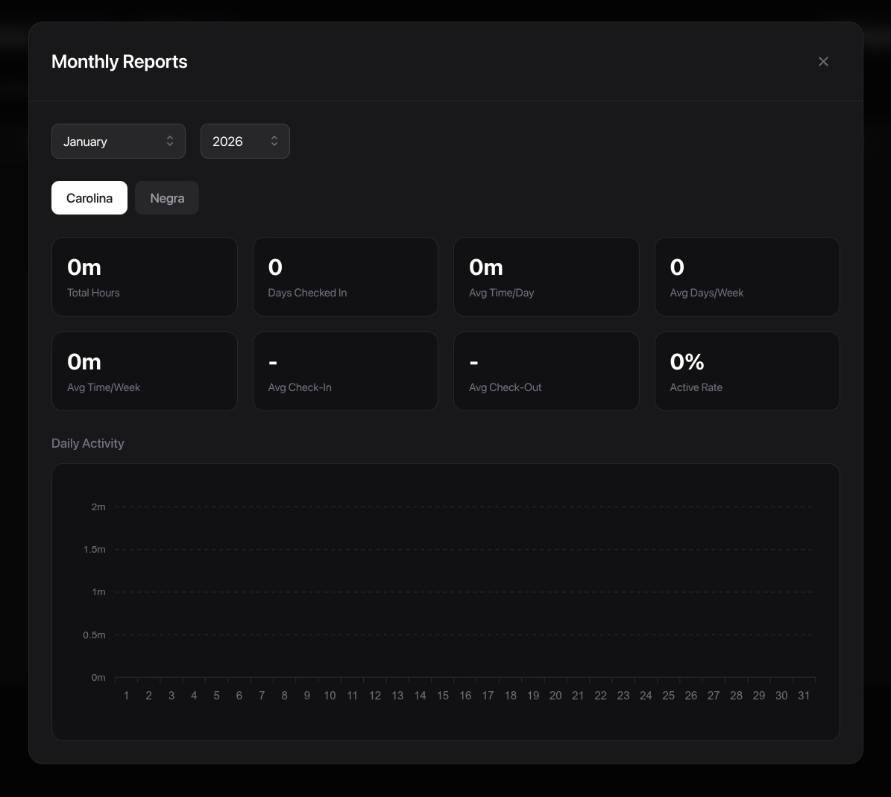

# WiFi Check-In

A presence tracking system that monitors device connectivity on your local network and provides detailed analytics on check-in patterns, session durations, and activity reports.

## Features

- **Automated Presence Detection** - Continuously monitors devices on your network by ping every 3 minutes
- **Session Tracking** - Automatically detects and groups connection periods into sessions
- **Interactive Calendar** - Visual calendar interface showing daily presence for each tracked person
- **Detailed Analytics** - View session timelines, first/last seen times, and total connection duration
- **Monthly Reports** - Comprehensive statistics including total hours, average daily time, check-in patterns, and activity rates
- **Real-time Status** - See current online/offline status for each person

## Screenshots

### Calendar View


### Session Details


### Monthly Reports


## Technologies

- **Next.js 16** - React framework with App Router
- **React 19** - UI library
- **TypeScript** - Type-safe development
- **Tailwind CSS 4** - Styling
- **ApexCharts** - Data visualization
- **Node.js** - Backend scanner service
- **Docker** - Containerized deployment

## Prerequisites

- Docker and Docker Compose
- Network access to ping target devices

## Installation

### Using Docker Compose (Recommended)

1. Clone the repository:
```bash
git clone <repository-url>
cd wifi-check-in
```

2. Create your configuration file:
```bash
cp scan.config.json.example scan.config.json
```

3. Edit `scan.config.json` with your device mappings:
```json
{
  "Person1": "192.168.1.100",
  "Person2": "192.168.1.101"
}
```

4. Start both services:
```bash
docker compose up -d
```

This will start:
- **Web Dashboard** on [http://localhost:4555](http://localhost:4555)
- **Scanner Service** running in the background

5. View logs:
```bash
docker compose logs -f
```

6. Stop services:
```bash
docker compose down
```

### Manual Installation

If you prefer to run without Docker:

1. Clone the repository:
```bash
git clone <repository-url>
cd wifi-check-in
```

2. Install dependencies:
```bash
npm install
```

3. Create your configuration file:
```bash
cp scan.config.json.example scan.config.json
```

4. Edit `scan.config.json` with your device mappings:
```json
{
  "Person1": "192.168.1.100",
  "Person2": "192.168.1.101"
}
```

5. Start the scanner:
```bash
npm run start-scan
```

6. In another terminal, start the web dashboard:
```bash
npm run dev
```

Then open [http://localhost:3000](http://localhost:3000) in your browser.

For production:
```bash
npm run build
npm start
```

## Configuration

Edit the `scan.config.json` file to add or remove tracked devices. The format is simple:

```json
{
  "PersonName": "IP_Address"
}
```

After updating the config, restart the scanner service for changes to take effect.

**Note:** The `scan.config.json` file is git-ignored to keep your network configuration private. Make sure to copy `scan.config.json.example` to `scan.config.json` before first use.

## Project Structure

```
wifi-check-in/
├── wifi-scanner.js            # Background scanner that monitors device presence
├── scan.config.json.example   # Example configuration file
├── scan.config.json           # Device configuration (person → IP mapping) - git ignored
├── check-ins/                 # Logged presence data organized by person/date
├── docker-compose.yml         # Docker Compose configuration
├── Dockerfile.web             # Web dashboard container
├── Dockerfile.scanner         # Scanner service container
├── src/
│   └── app/
│       ├── page.tsx           # Main dashboard page
│       ├── Calendar.tsx       # Calendar view component
│       ├── lib/               # Session calculation logic
│       └── components/        # UI components (modals, selectors)
└── images/                    # Screenshots
```

## How It Works

1. **Scanner** - The Node.js scanner pings configured IP addresses at regular intervals and logs the results in CSV format (`timestamp,status`)
2. **Session Detection** - The web app reads these logs and intelligently groups consecutive online periods into sessions
3. **Visualization** - Data is displayed through an interactive calendar, detailed session views, and comprehensive monthly reports

## License

MIT
